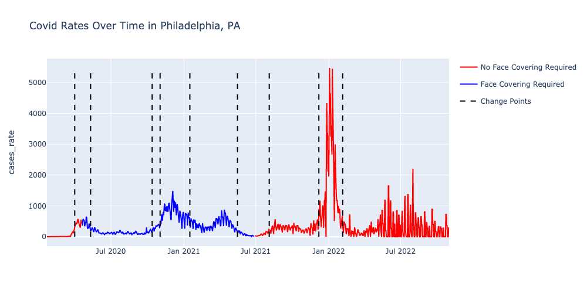
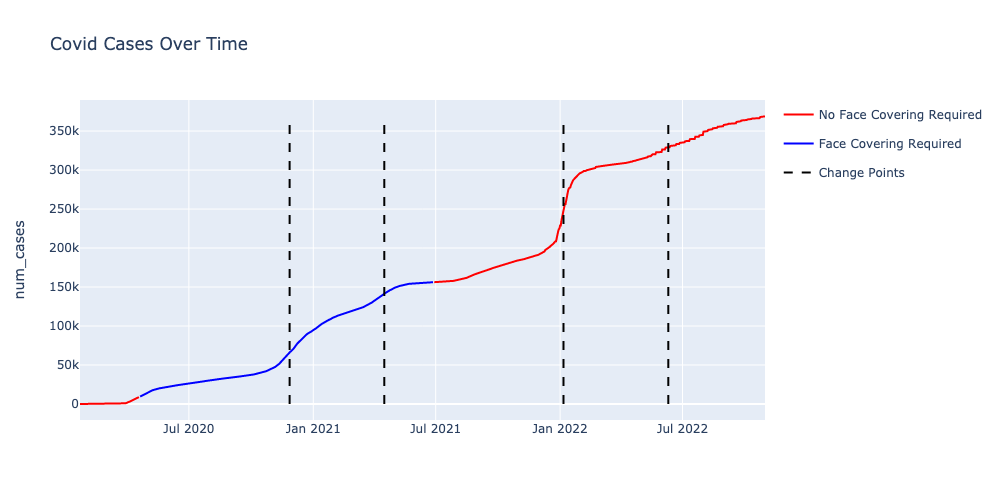
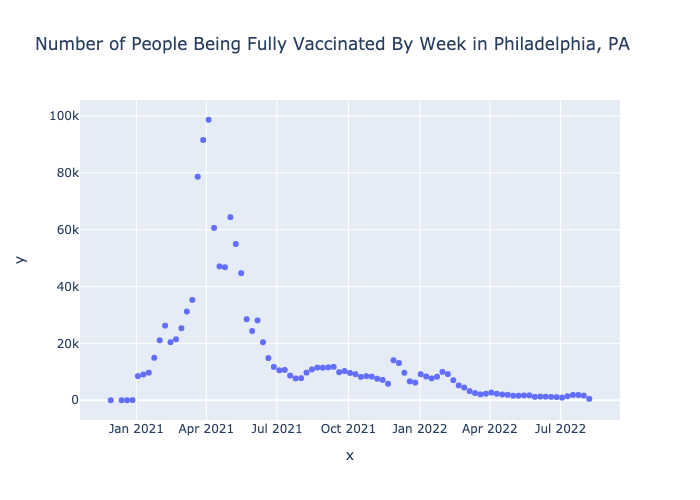

# DATA512 Project Part 1

## Project Goal
The goal of this project is to collaborate with my peers to analyze Covid-19 data as well as mask mandate data to answer the question How did masking policies change the progression of confirmed COVID-19 cases from February 1, 2020 through October 1, 2021?

## Project Description
For this project we use Covid-19 Cases data from Johns-Hopkins, CDC data about mask mandates and data from the New York Times mask compliance survey to create visualizations to analyze how masking policies changed the progression of confirmed COVID-19 cases

## Project Files
- RAW_us_confirmed_cases.csv
  -  CSV data of number of confirmed cases by county
- U.S._State_and_Territorial_Public_Mask_Mandates_From_April_10__2020_through_August_15__2021_by_County_by_Day.csv
  -  CSV data of mask mandates by county
-  mask-use-by-county.csv
  - CSV data of survey mask compliance from the NYT by county
- covid_vaccines_by_date.csv
  - CSV data of number of people vaccinated per day in Philadelphia

## Output Files
**Note:** Graphs are explained in more detail in Visualization Explanation.md

 
 Graph of the rates of COVID-19 in Philadelphia over time
 
  
  Graph of the number of COVID-19 cases in Philadelphia over time
  
   
  Pie Chart of survey data of COVID-19 compliance in Philadelphia
  
   
  Graph of number of people vaccinated per week in Philadelphia
  
  - Visualization Explanation.md: Detailed Explanations of all Graphs
  - Reflection.md: Reflection of Analysis
  - DATA512 Project Part 1.ipynb: Code for analysis and visualization

## Project Sources and Licenses

[US Confirmed Cases]('https://www.kaggle.com/datasets/antgoldbloom/covid19-data-from-john-hopkins-university')

[US Mask Mandates]('https://data.cdc.gov/Policy-Surveillance/U-S-State-and-Territorial-Public-Mask-Mandates-Fro/62d6-pm5i')

[Mask Compliance]('https://github.com/nytimes/covid-19-data/tree/master/mask-use')

[Philadelphia Vaccine Data]('https://www.phila.gov/programs/coronavirus-disease-2019-covid-19/vaccines/vaccine-data/')
