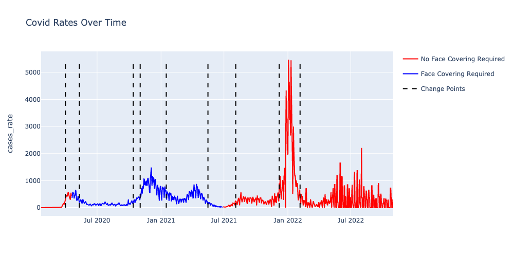
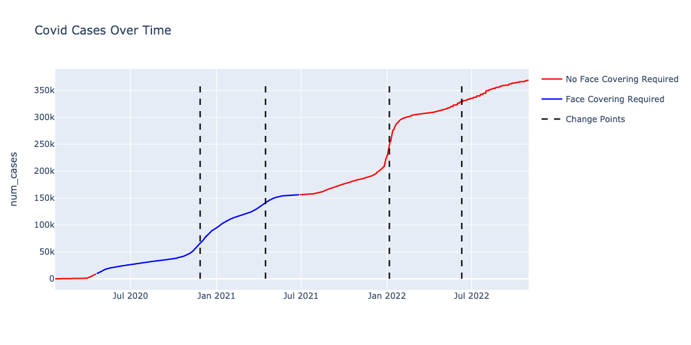
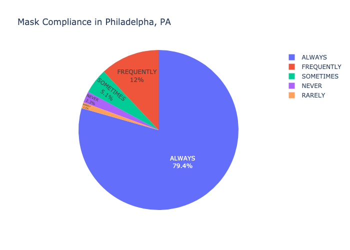
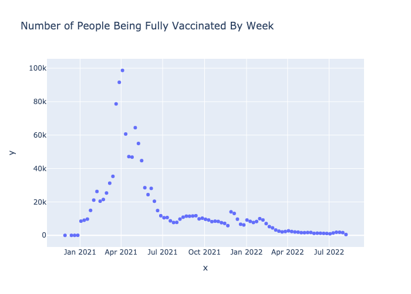

# Visualization Explanation
 
 
 The above graph visualizes the rate of covid over time in Philadelphia, PA. The 'rate' of covid is calculated by taking the gradient of the number of cases over time to find the rate of change. The x-axis displays the dates from early 2020 to summer 2022. The y-axis displays the rate of change of covid. The colors shows whether there was a mask mandate at the time. Red indicates that there was no mask mandated and blue indicates there was a mask mandate during the time. We found whether there was a mask mandate or not by joining the covid cases data with the mask mandate data by the date. If there was no value available for the mask mandate it was just set as 'No'. The black lines indicate the change points. The national library of medicine defines change points as the "abrupt variations in time series data. Such abrupt changes may represent transitions that occur between states."
 
 
 This graph is very similar to the first graph. We visualize the number of covid cases over time in Philadelphia. This data is from the John Hopkins University Covid-19 Data. The x-axis displays the dates from early 2020 to summer 2022. The y-axis displays the number of covid cases per day in Philadelphia, PA.The colors shows whether there was a mask mandate at the time. Red indicates that there was no mask mandated and blue indicates there was a mask mandate during the time. We found whether there was a mask mandate or not by joining the covid cases data with the mask mandate data by the date. If there was no value available for the mask mandate it was just set as 'No'.
 
  
 
This graph is a pie chart of the mask compliance data for the city of Philadelphia, PA collected by the New York Times. The way to read this graph is that each section shows the percentage of responders that responded with that particular response. So, for example 79.4% of people responded that they always follow the mask mandates. The underlying data is from the New York Times Mask Compliance survey and it was filtered to only include data from Philadelphia, PA. 

 

This graph shows the number of people vaccinated per week in Philadelphia, PA. This data was pulled from the Open Data Philly website and there was not much processing done to this data. The x-axis shows the dates from January 2021 to summer 2022. The y-axis shows the number of people who became fully vaccinated each week. We can see the trends of people who are becoming vaccinated and also compare it to covid cases in graph one and two to see how the vaccinations effected the number of covid cases.
